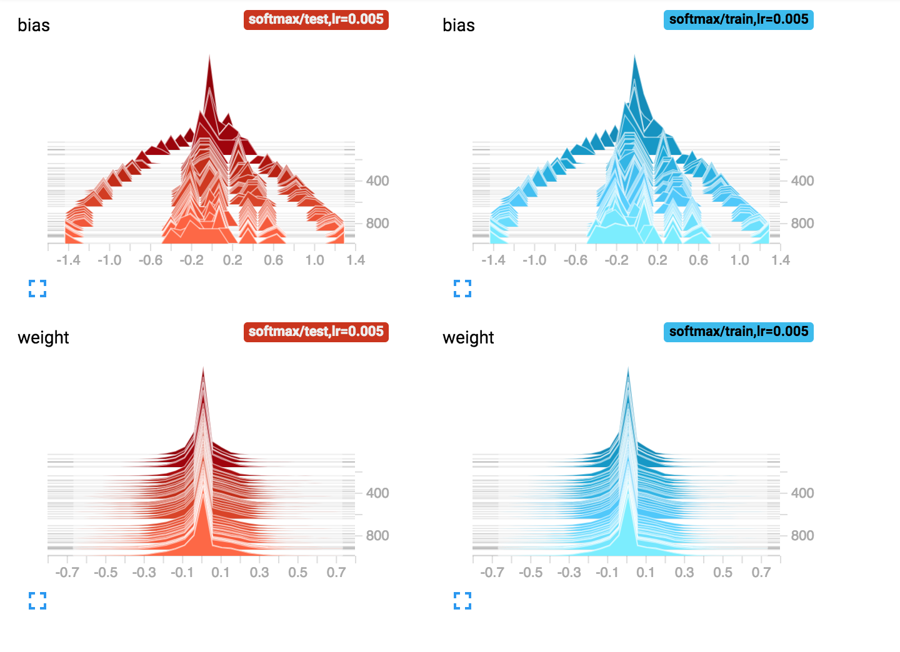

# Linear Classifier for Image classification using Tensorflow


#### Table of Content
1. [Usage](#usage)
2. [Dependency](#dependency)
3. [Computational Graph](#thegraph)
4. [Input](#input)
5. [The Model](#model)
6. [Minimizing loss and Improving Accuracy](#lossaccur)
7. [Changing weight and bias](#wb)


## Usage <a name="usage"><a/>
- Downlaod softmax.py 
- Execute with `python softmax.py`.
- Visualize with `tensorboard --logdir /tmp/tboard/softmax`

You can expect an accuracy of about `91% +` in test image.

That's It!

## Dependency <a name="dependency"><a/>
- tensorflow 1.4 (and tensorboard for visualization)
- developed and tested in python3.6
- you need to have write permission in /tmp (who doesn't)

## The Computational Graph <a name="thegraph"><a/>
softmax.py is an implementation of a linear classifier with softmax link function. 
Following is the computational graph


### Input <a name="input"><a/>

Following is the input dataset used as an example. It is MNIST dataset containing hand written digits.
The code utilized tensorflow inbuild modules to download the data in your working directory.
Input are of 28x28x1 dimension that is flattened out before using in the model. 
```python
nist = mnist_data.read_data_sets("data",one_hot=True, reshape=False, validation_size=0)
```


### The Model <a name="model"><a/>
It is a linear classifer model with [softmax link function](https://en.wikipedia.org/wiki/Softmax_function) for multiclass classification
```python
y = tf.nn.softmax(tf.matmul(xx,w)+b)
```

### Minimizing loss and improving accuracy <a name="lossaccur"> <a/>
We use the [cross entropy loss](https://en.wikipedia.org/wiki/Cross_entropy) function. Note that, due to [one-hot encoding](https://en.wikipedia.org/wiki/One-hot) of Y and taking log, numerically the loss value becomes very small. Miniming such a loss function becomes numerically very challenging in implmentation. Hence, we scaled the loss by multiplying with 1000. 

```python
cross_entropy = -tf.reduce_mean(y_*tf.log(y)) * 1000
```
We utilize a mini-batch technique to calculate gradient desend. Batch size is 100 images. So, in every step towards desend, we use a differnt set of images(instead of all the image) to calculate the direction of desend. That is why you can see some variance in the loss function output in training phase. However, in test phase we do not see such variance.
Below are graphs showing how log is decreasing and accuracy is increasing in both training phase (blue) and test phase(red).


And the zoomed in version


### Tuning learning rate

Learning rate (hyper parameter in our model) tuning is achieved but runnign the computational graph with multiple setting. Following is a comparision of train and test perfromance of various learning rate.

```python
 58 for learning_rate in [0.002,0.005,0.008]:
 59     # init
 60     init = tf.global_variables_initializer()
 61     sess = tf.Session()
 62     sess.run(init)
 63     with tf.name_scope('train'):
 64         train_step = tf.train.GradientDescentOptimizer(learning_rate).minimize(cross_entropy)
```
|  |  |
|:--|:--:|
|  |  |


Impact of different larning rate on test dataset

|  |  |
|:--|:--:|
|  |  |

Note, with large learning rate (0.008) loss function taken large step but often did not go to the direction of decreasing loss (hence the spikes), as expected. The smallest learning rate 0.002 had a very smooth decend to the minima. 

Learning rate of 0.005 seems to be a good compromise between speed and accuracy of minimizing the loss function. 

### Changing weights biases <a name="wb"><a/>

We can observe how our weights and biases have changed over multiple steps (1000 in this case) of the training phase as losses minimizes. Note, most of our weights are closed to zero as there are very few pixels that actually contribute in making a digit (most of the pixels forms the background).


yet another useful view




